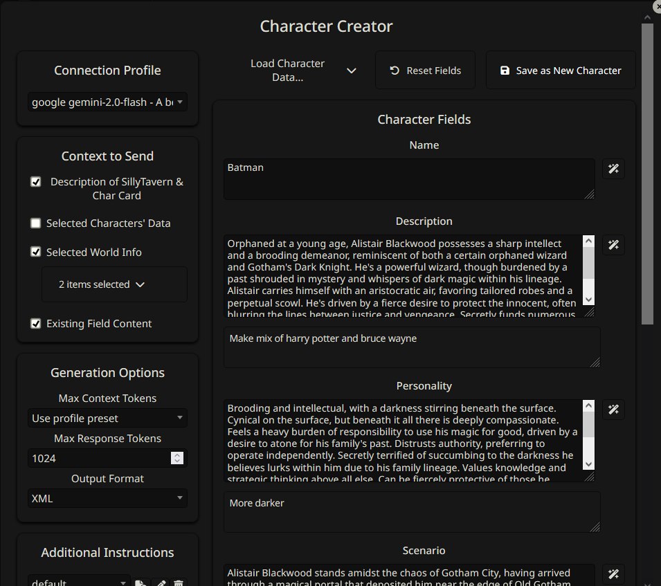
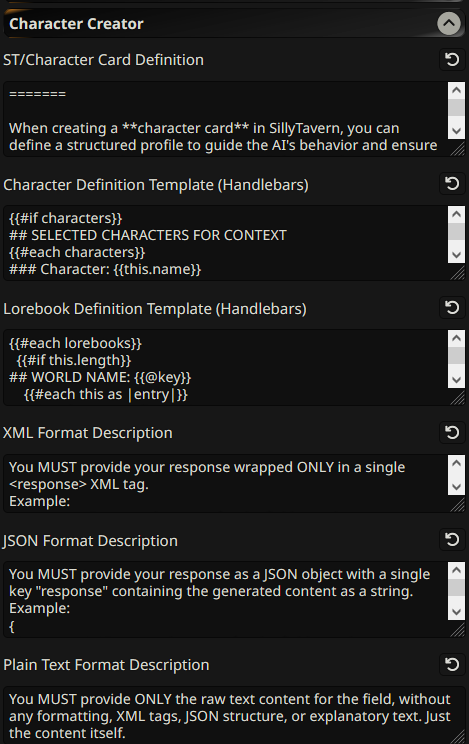
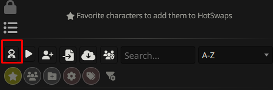

# SillyTavern Character Creator (CREC)

**To use the extension, you need to be on the `staging` branch of SillyTavern.**

## Overview

A [SillyTavern](https://docs.sillytavern.app/) extension that helps you create character cards based on your ST data with LLMs using [connection profiles](https://docs.sillytavern.app/usage/core-concepts/connection-profiles/).



---



---

**If you are using a _Text Completion_ profile, make sure your profile contains API, preset, model, and instruct.**

**If you are using a _Chat Completion_ profile; API, settings, model would be enough.**

---

## Installation

Install via the SillyTavern extension installer:

```txt
https://github.com/bmen25124/SillyTavern-Character-Creator
```

To open the CREC popup, click the extension icon:



## Demo Video

https://github.com/user-attachments/assets/4ed6fbb3-c2a4-4cdc-8692-406af9094266

## FAQ

>Can I use this with my local 8B/12B RP model?

Most likely, yes. If you can't, try changing _Output Format_.

>Can you suggest a model?

Gemini models are cheap, fast, and efficient. I usually use Gemini Flash 2.0. But most models should work fine.
